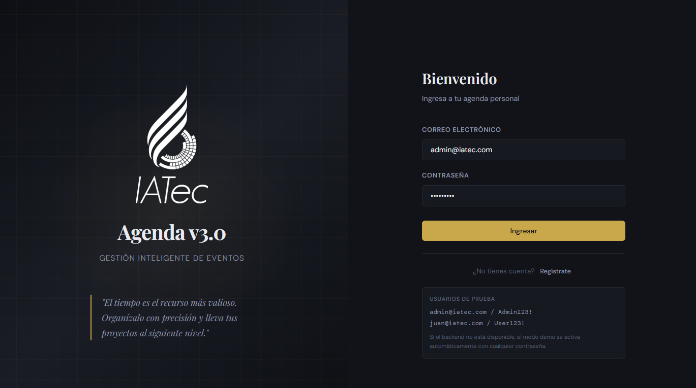
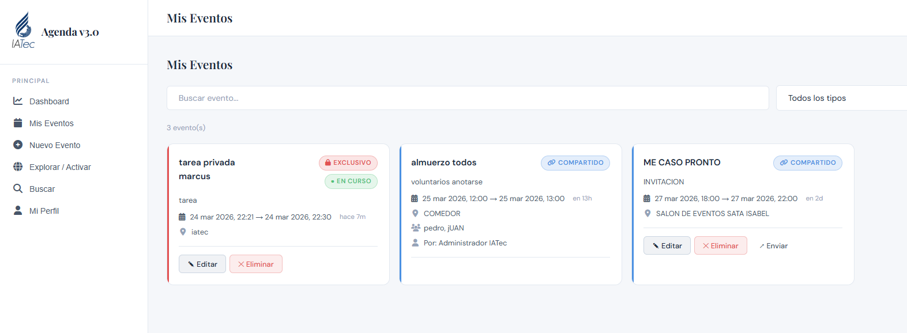
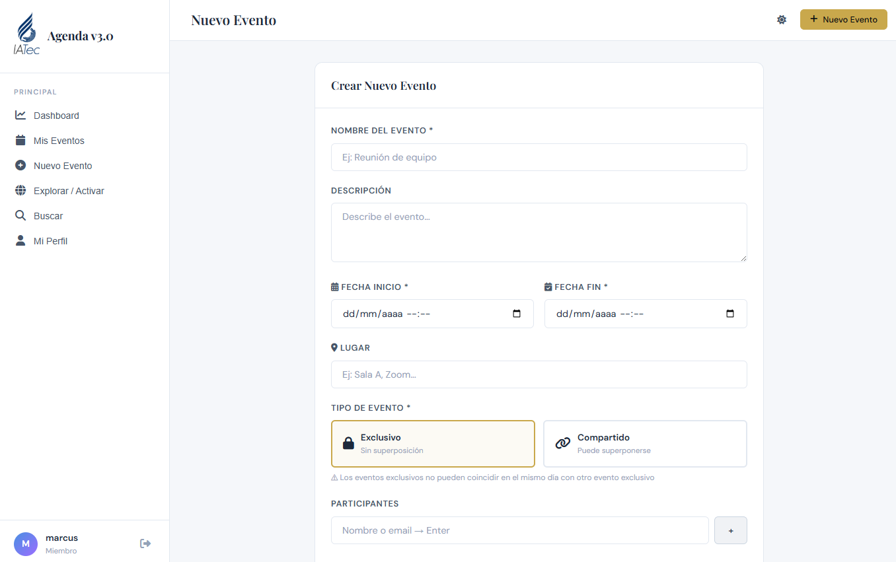
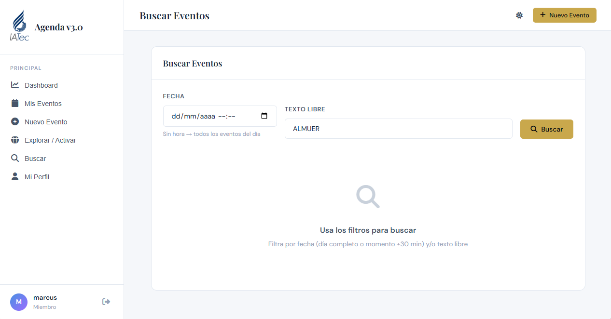

#  Agenda IATEC

Aplicación web desarrollada como solución al desafío técnico de IATec, enfocada en la gestión de agendas personales con control de eventos exclusivos y compartidos.

---

##  Descripción

Agenda IATEC permite a cada usuario administrar sus eventos de manera eficiente, evitando conflictos de horario en eventos exclusivos y facilitando la colaboración mediante eventos compartidos.

El sistema fue diseñado pensando en usabilidad, control de tiempos y visualización clara de la información.

---

##  Tecnologías utilizadas

- **Backend:** C# - .NET WebAPI  
- **Base de datos:** SQL Server  
- **Frontend:** HTML, CSS, JavaScript (sin frameworks)  

---

##  Funcionalidades principales

- Gestión completa de eventos (crear, editar y eliminar)
- Eventos de tipo:
  - **Exclusivo:** no permite superposición de horarios
  - **Compartido:** puede ser enviado a otros usuarios
- Validación de conflictos de horario en tiempo real
- Filtro de eventos por:
  - Fecha (con o sin hora)
  - Texto (nombre, descripción o lugar)
- Dashboard con:
  - Eventos en curso
  - Próximos eventos
- Visualización clara y ordenada de la agenda

---

##  Vista del sistema

###  Inicio de sesión

---

###  Dashboard (eventos en curso y próximos)

---

###  Creación de eventos

---

###  Búsqueda y filtrado

---

###  Modo oscuro

 

##  Lógica implementada

Uno de los puntos clave del sistema es el control de eventos exclusivos:

- No se permite crear eventos que se crucen en horario con otros eventos exclusivos
- Se valida mediante intersección de rangos de tiempo
- En caso de conflicto, el sistema muestra un mensaje indicando el evento existente y su horario

Ejemplo:
> Ya tienes un evento exclusivo "Reunión" desde 08:00 hasta 09:00.  
> No puedes crear otro evento en ese rango de horario.

 

##  Estructura del proyecto
/backend → API en .NET
/frontend → Interfaz web (HTML, CSS, JS)
/docs → Capturas del sistema

## Ejecución del proyecto

1. Clonar el repositorio:
 git clone https://github.com/quino111/iatec.git
2. Configurar la base de datos
3. Ejecutar el backend (.NET WebAPI)
4. Abrir index.html del frontend en el navegador

## Autor

Marco Quino
